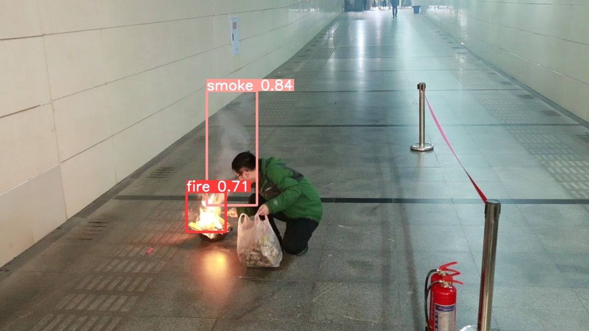
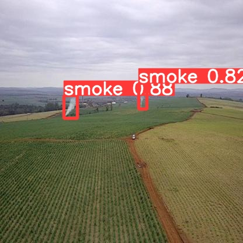

🔥 Fire and Smoke Detection using Enhanced YOLOv8

Real-Time Fire and Smoke Detection Using Lightweight Attention-Enhanced YOLOv8 for Surveillance and Embedded Systems

This repository presents a real-time fire and smoke detection framework based on YOLOv8, enhanced with attention mechanisms and lightweight convolutions for improved accuracy and deployment on resource-constrained devices.

The model is designed for early fire warning systems, smart surveillance, and embedded AI applications such as Jetson Nano, Xavier, and edge GPUs.

🚀 Demo Results
🔹 Detection on Images

   
 
   

🔹 Detection on Video

🧠 Model Architecture

The proposed framework is built upon YOLOv8, with architectural enhancements to balance accuracy, speed, and model size.

Key Modifications:

✔ Efficient Channel Attention (ECA) for feature refinement

✔ Lightweight C3Ghost convolution for reduced parameters

✔ Optimized detection head for fire & smoke characteristics

✔ Multi-scale feature learning for small and dense smoke regions

  

📊 Performance Overview
Model	Input Size	Params	FLOPs	mAP@50	mAP@50–95	FPS
YOLOv8 (Baseline)	640	11.2M	28.4G	82.1%	56.7%	85
YOLOv8 + CBAM	640	11.9M	30.1G	84.3%	58.9%	78
YOLOv8 + ECA (Proposed)	640	11.4M	28.9G	86.2%	61.3%	83
YOLOv8-Nano (Edge)	640	3.2M	8.1G	80.4%	53.2%	120
🗂️ Datasets

The model is trained and evaluated on two publicly available fire & smoke datasets:

🔹 FASDD (Fire and Smoke Detection Dataset)

Indoor & outdoor fire scenes

Dense smoke and flame variations

Used for training and validation

🔹 FS Dataset

Challenging real-world fire & smoke scenarios

Used for generalization and benchmarking

📁 Dataset Structure
dataset/
 ├── images/
 │   ├── train
 │   ├── val
 │   └── test
 └── labels/
     ├── train
     ├── val
     └── test

🧪 Data Augmentation

To improve robustness, the following augmentations are applied:

Mosaic & MixUp

HSV color jitter

Random scaling & flipping

Motion blur for smoke diffusion

⚙️ Environment Setup
🔹 Requirements
pip install -r requirements.txt

🔹 Tested Environment

OS: Ubuntu / Windows 10

Python: 3.9

PyTorch: 2.0.1

CUDA: 11.7

GPU: Tesla T4 / RTX / Jetson

🏋️ Training & Validation
🔹 Configure Dataset

Update dataset paths in:

data/fire_smoke.yaml

🔹 Train Model
yolo task=detect mode=train model=yolov8m.yaml data=fire_smoke.yaml epochs=100 imgsz=640

🔹 Train with ECA (Proposed)
yolo task=detect mode=train model=yolov8m_ECA.yaml data=fire_smoke.yaml epochs=100 imgsz=640

🔍 Inference
Image
yolo task=detect mode=predict model=best.pt source=demo/images

Video
yolo task=detect mode=predict model=best.pt source=demo/video/fire.mp4

📦 Deployment

✔ Jetson Nano / Xavier

✔ TensorRT & ONNX supported

✔ Real-time RTSP camera inference

✔ Edge & surveillance systems

📌 Applications

🔥 Early fire detection systems

🏭 Industrial safety monitoring

🏢 Smart buildings & surveillance

🌲 Forest fire detection

🤖 Embedded & edge AI systems

📖 Citation

If you find this work useful, please cite:

@article{khan2024firesmoke,
  title={Real-Time Fire and Smoke Detection Using Lightweight Attention-Enhanced YOLOv8},
  author={Khan, Qaiser},
  journal={Under Review},
  year={2024}
}

🤝 Acknowledgements

Ultralytics YOLOv8

Open-source fire & smoke datasets

Research community in computer vision & safety systems

📬 Contact

Qaiser Khan
Mechatronics Engineer | AI & Robotics
📧 Email: your-email@domain.com

🔗 GitHub: https://github.com/Qaiser007khan
